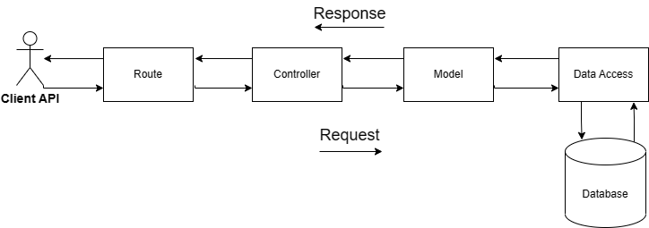

## Tokopedia Play Clone API Midterm GIGIH 3.0

Tokopedia Play Clone Backend API Service use Express and MongoDB provide http request and response also store data to MongoDB.

## About the project

This repository project made for fulfillment task midterm GIGIH 3.0.

## Features

- Get all video
- Get all products
- Get products by video id
- Get comments by video id
- Post comments by video id
- Search video by title

## Run Locally

Clone the project

```bash
git clone https://github.com/rakaiskandar/midterm-gigih-3.0.git
```

Go to the project directory

```bash
cd midterm-gigih-3.0
```

Create `.env` file and insert

```bash
PORT=YOUR_PORT
DB_URL=YOUR_MONGODB_URL
```

Install dependencies

```bash
npm install
```

Start the server

```bash
npm start
```

_notes: database will be migrated automatically_

## Database Structure

The application uses MongoDB to store database. The database based document an have 3 main collection:

- `Videos: consist a data video field which references from youtube id`
- `Products: consist a data product field which references from video id collection`
- `Comments: consist a data comment field which references from video id collection`

## Database Schema

Schema database that used for backend service:

- Videos

```json
{
    videoId: string [required],
    videoThumb: string [required],
    title: string [required]
}
```

- Products

```json
{
    productId: string [required],
    videoId: string [required],
    url: string [required],
    title: string [required],
    price: number [required]
}
```

- Comments

```json
{
    commentId: string [required],
    videoId: string [required],
    username: string [required],
    comment: string [required],
    date: Date [required]
}
```

## API Structure
```tree
|___src
    |___configs
    |___controllers
    |___databases
    |   |___models
    |   |___seeders
    |___routes
    |___utils
.env
index.js
```
Folder structure that used for backend service:

- `src: root folder for rendering source code`
- `configs: for configs prefix or validation`
-` controllers: handle request and response`
- `databases: root folder for data access layer`
- `models: provide schema data for database`  
- `seeders: provide data migartion automatically`
- `routes: handle endpoint for controllers`
- `utils: utility function that used for needs`
- `.env: environtment variable for development`
- `index.js: entry point for app`

Flow A:


## API Endpoint

| METHOD | ROUTE                | FUNCTIONALITY                 | ACCESS      |
| ------ | -------------------- | ----------------------------- | ----------- |
| _GET_  | `/api`               | _Get API Service_             | _All users_ |
| _GET_  | `/api/videos`        | _Gets a list all video_       | _All users_ |
| _GET_  | `/api/videos/search` | _Search video by query_       | _All users_ |
| _GET_  | `/api/products`      | _Gets a list all products_    | _All users_ |
| _GET_  | `/api/products/:id`  | _Gets a products by video id_ | _All users_ |
| _GET_  | `/api/comments/:id`  | _Gets a comment by video id_  | _All users_ |
| _POST_ | `/api/comments/:id`  | _Post a comment by video id_  | _All users_ |

## API Request and Response

An example list API request and response you can see in [API Example](https://gist.github.com/rakaiskandar/99528f041c7d02f8e19af892daef8c76)
